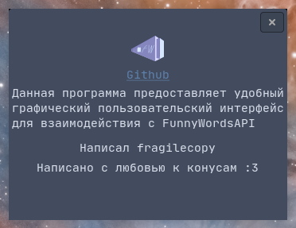

# fwgui

fwgui (FunnyWords GUI) is a simple GUI for interacting with FunnyWords API.

## Some screenshots




## Installation

See Releases page

### Compiling

Clone repository, install gtk-devel and gtk libraries.

Then do

```cr
crystal build src/fw.cr --release
```

## Contributing

1. Fork it (<https://github.com/Funny-Words/fwgui/fork>)
2. Create your feature branch (`git checkout -b my-new-feature`)
3. Commit your changes (`git commit -am 'Add some feature'`)
4. Push to the branch (`git push origin my-new-feature`)
5. Create a new Pull Request

## Contributors

- [uebernihilist](https://github.com/uebernihilist) - creator and maintainer

## License

[MIT](./README.md)
