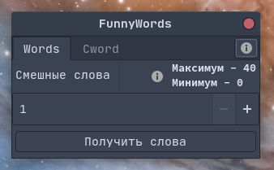
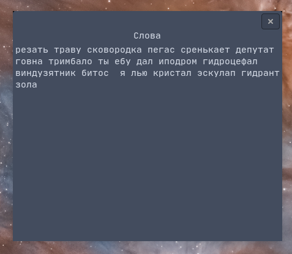

# Fwgui

Fwgui (FunnyWords GUI) is a simple GUI for interacting with FunnyWords API.





## Installation

Right now installation isn't possible.

### Compiling

Clone repository, install gtk-devel and gtk libraries.

Then do

```cr
shards build
```

## Contributing

1. Fork it (<https://github.com/fragilecopy/fwgui/fork>)
2. Create your feature branch (`git checkout -b my-new-feature`)
3. Commit your changes (`git commit -am 'Add some feature'`)
4. Push to the branch (`git push origin my-new-feature`)
5. Create a new Pull Request

## Contributors

- [fragilecopy](https://github.com/fragilecopy) - creator and maintainer
